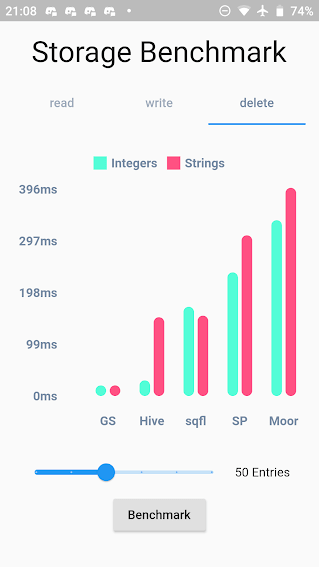
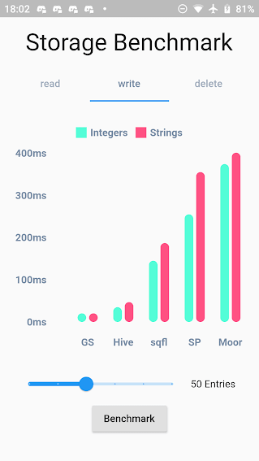
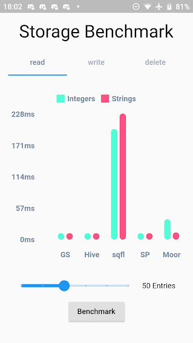

# get_storage
A fast, extra light and synchronous key-value in memory, which backs up data to disk at each operation.
It is written entirely in Dart and easily integrates with Get framework of Flutter.

Supports Android, iOS, Web, Mac, Linux, and fuchsia and Windows**. 
Can store String, int, double, Map and List

### Add to your pubspec:
```
dependencies:
  get_storage:
```
### Install it

You can install packages from the command line:

with `Flutter`:

```css
$  flutter packages get
```

### Import it

Now in your `Dart` code, you can use: 

````dart
import 'package:get_storage/get_storage.dart';
````

### Initialize storage driver with await:
```dart
main() async {
  await GetStorage.init();
  runApp(App());
}
```
#### use GetStorage through an instance or use directly `GetStorage().read('key')`
```dart
final box = GetStorage();
```
#### To write information you must use `write` :
```dart
box.write('quote', 'GetX is the best');
```

#### To read values you use `read`:
```dart
print(box.read('quote'));
// out: GetX is the best

```
#### To remove a key, you can use `remove`:

```dart
box.remove('quote');
```

#### To listen changes you can use `listen`:
```dart
Function? disposeListen;
disposeListen = box.listen((){
  print('box changed');
});
```
#### If you subscribe to events, be sure to dispose them when using:
```dart
disposeListen?.call();
```
#### To listen changes on key you can use `listenKey`:

```dart
box.listenKey('key', (value){
  print('new key is $value');
});
```

#### To erase your container:
```dart
box.erase();
```

#### If you want to create different containers, simply give it a name. You can listen to specific containers, and also delete them.

```dart
GetStorage g = GetStorage('MyStorage');
```

#### To initialize specific container:
```dart
await GetStorage.init('MyStorage');
```

## SharedPreferences Implementation
```dart
class MyPref {
  static final _otherBox = () => GetStorage('MyPref');

  final username = ''.val('username');
  final age = 0.val('age');
  final price = 1000.val('price', getBox: _otherBox);

  // or
  final username2 = ReadWriteValue('username', '');
  final age2 = ReadWriteValue('age', 0);
  final price2 = ReadWriteValue('price', '', _otherBox);
}

...

void updateAge() {
  final age = 0.val('age');
  // or 
  final age = ReadWriteValue('age', 0, () => box);
  // or 
  final age = Get.find<MyPref>().age;

  age.val = 1; // will save to box
  final realAge = age.val; // will read from box
}
```


## Benchmark Result:
**GetStorage is not fast, it is absurdly fast for being memory-based. All of his operations are instantaneous. A backup of each operation is placed in a Container on the disk. Each container has its own file.**





## What GetStorage is:
Persistent key/value storage for Android, iOS, Web, Linux, Mac and Fuchsia and Windows, that combines fast memory access with persistent storage.
## What GetStorage is NOT:
A database. Get is super compact to offer you a solution ultra-light, high-speed read/write storage to work synchronously. If you want to store data persistently on disk with immediate memory access, use it, if you want a database, with indexing and specific disk storage tools, there are incredible solutions that are already available, like Hive and Sqflite/Moor.


As soon as you declare "write" the file is immediately written in memory and can now be accessed immediately with `box.read()`. You can also wait for the callback that it was written to disk using `await box.write()`.

## When to use GetStorage:
  - simple Maps storage.
  - cache of http requests
  - storage of simple user information.
  - simple and persistent state storage
  - any situation you currently use sharedPreferences.

## When not to use GetStorage:
  - you need indexes.
  -  when you need to always check if the file was written to the storage disk before starting another operation (storage in memory is done instantly and can be read instantly with box.read(), and the backup to disk is done in the background. To make sure the backup is complete, you can use await, but if you need to call await all the time, it makes no sense you are using memory storage).

### You can use this lib even as a modest persistent state manager using Getx SimpleBuilder
